## Module 2: Learn the Fundamentals of Dynamics 365 Sales

## Practice Lab 2.2 - Create and manage an Opportunity in Dynamics 365 Sales 

## Objectives

During this exercise, you will be manually capturing a sales opportunity for an existing customer named Jim Glynn. He works for a company called Adventure Work. Not only will you be capturing the opportunity in the system, but you will be using the tools available in Dynamics 365 Sales to work through and close the opportunity.

## Lab Setup

  - **Estimated Time**: 25 minutes

## Instructions

In this exercise, you will become familiar with how to access the different Dynamics 365 Customer engagement applications by using the Dynamics 365 Home screen. 

1. If it not open already, open the **Dynamics 365 Sales Hub** application. 

1. Using the navigation on the left side of the screen, select **Opportunities**. 

   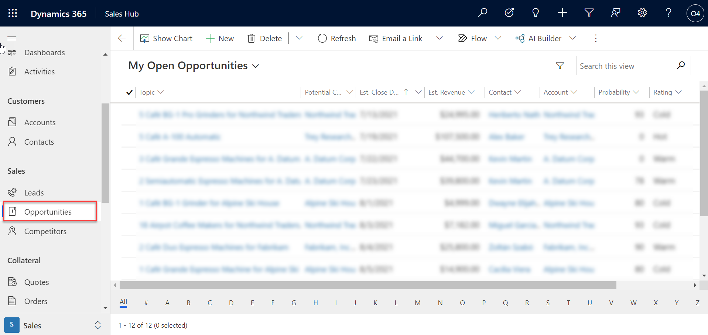

1. On the **My Open Opportunities** view, select the **New** button to create a new opportunity.

   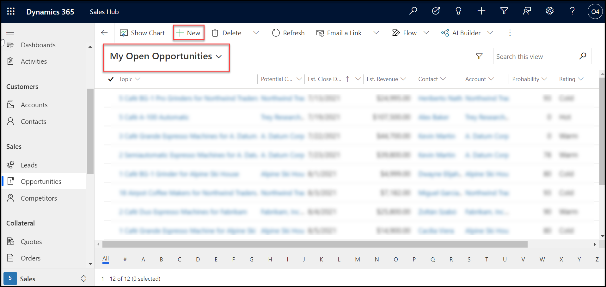

1. Complete the opportunity information as follows:

	- **Topic:** Wants to upgrade their existing equipment – Your Initials

	- **Contact:** Jay Klein

	- **Account:** Northwind Traders

	- **Purchase Timeframe:** This Quarter

	- **Budget Amount:** 50,000

	- **Purchase Process:** Individual

   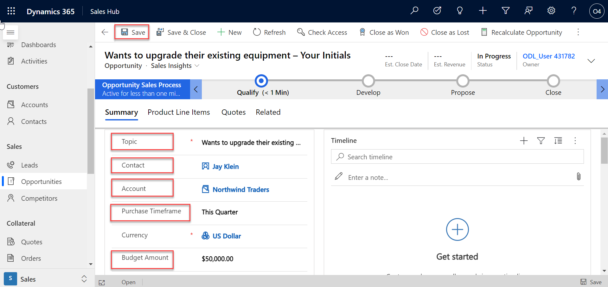

1. On the **New Opportunity Header** at the top of the record, select the down arrow next to the owner field. 

1. Complete as follows:

	- **Est. Close Date:** Two days from today

	- **Est Revenue:** 50,000
	
   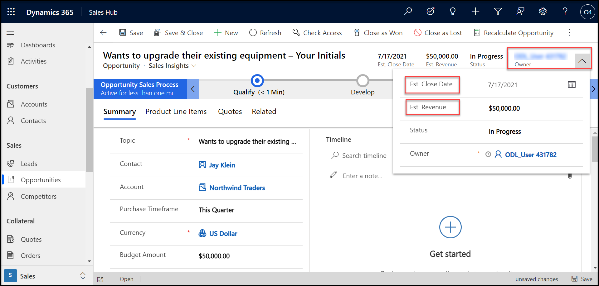

1. On the **Command Bar** at the top, select the **Save and Close** button. 

   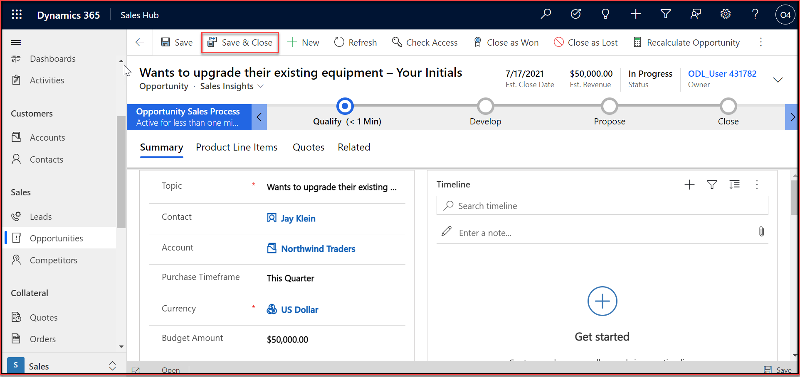

1. On the **My Open Opportunities** view, locate and open the **Looking for new equipment** opportunity that was created when you qualified the lead in the previous exercise. 

   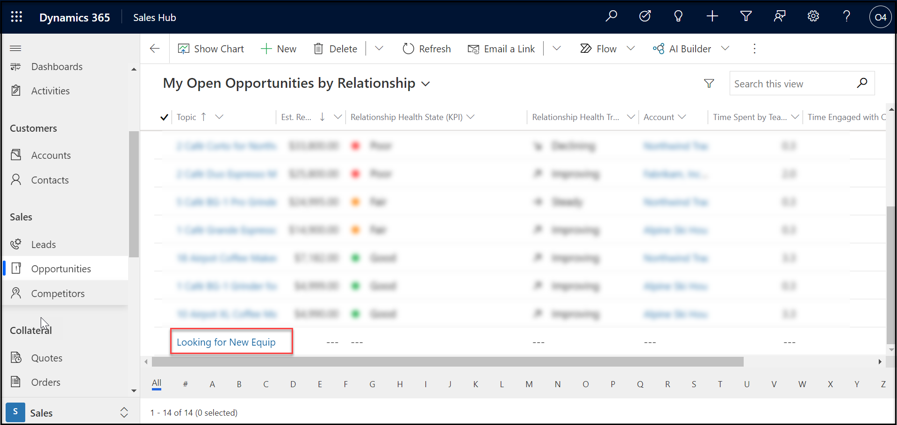

1. Notice the record is already in the **Develop** phase of the opportunity of the Lead to Opportunity process. 

1. On the **Looking for new equipment opportunity header** at the top of the record, select the down arrow next to the owner field. 

1. Complete as follows:

	- **Est. Close Date:** Tomorrow

	- **Est Revenue:** 70,000

   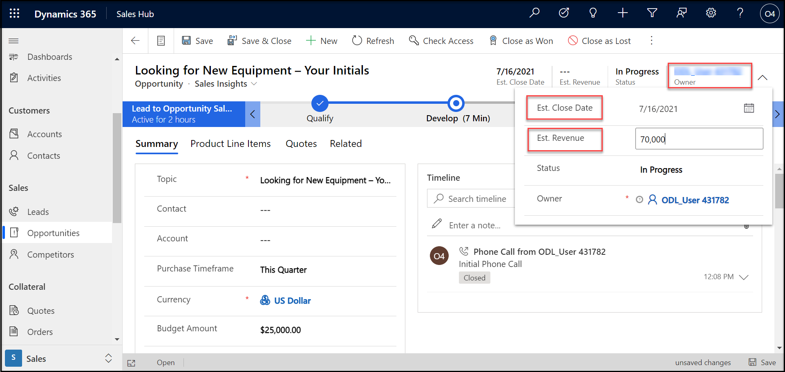

1. On **Summary** Section below the Lead to Opportunity Business Process Flow, In the contact field click on **+ New Contact**.

   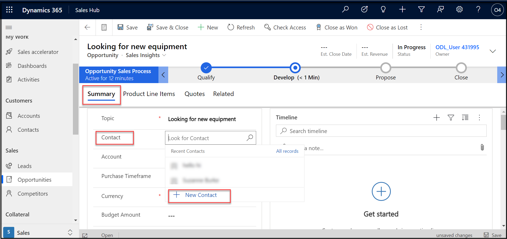

1. Complete as follows:
               
   - **First Name:** Suzanne
   - **Last Name:** Burke

   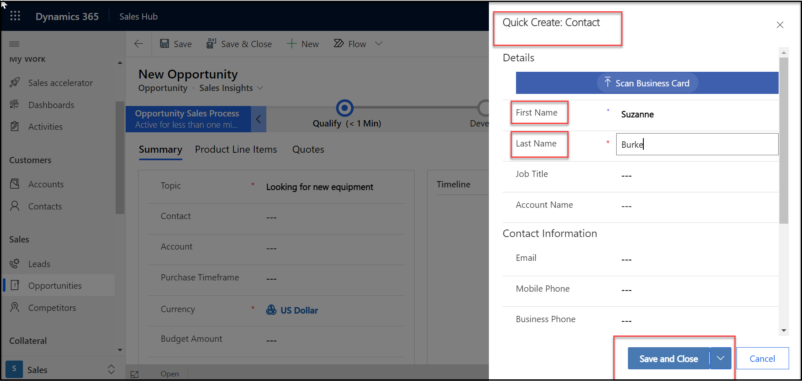

1. select the **Save and Close** button.

1. Notice the Suzanne Burke is added in the contact field.

   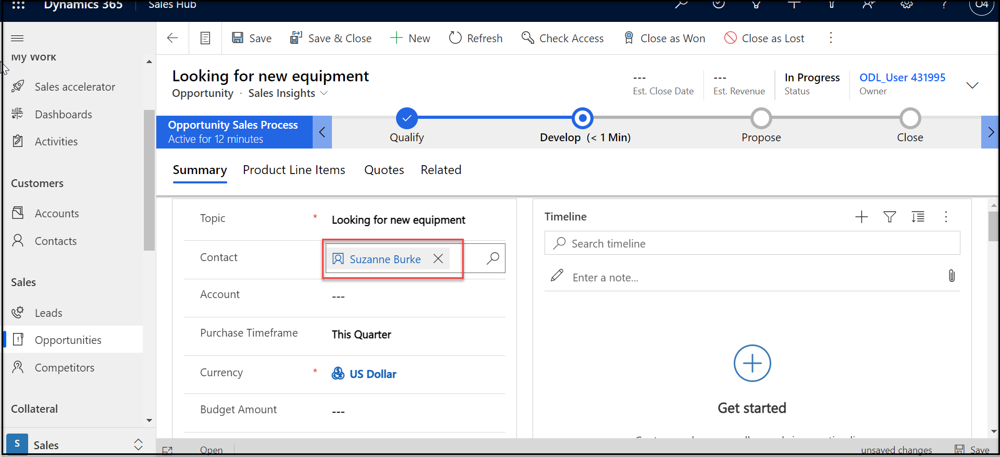

1. In the Stakeholders sub-grid, notice the Suzanne Burke is already defined as a stakeholder. 

   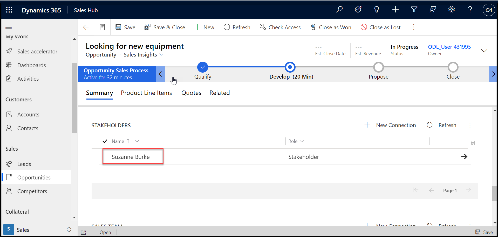

1. On the Sales Team sub-grid,select **+ New Connection**. 

   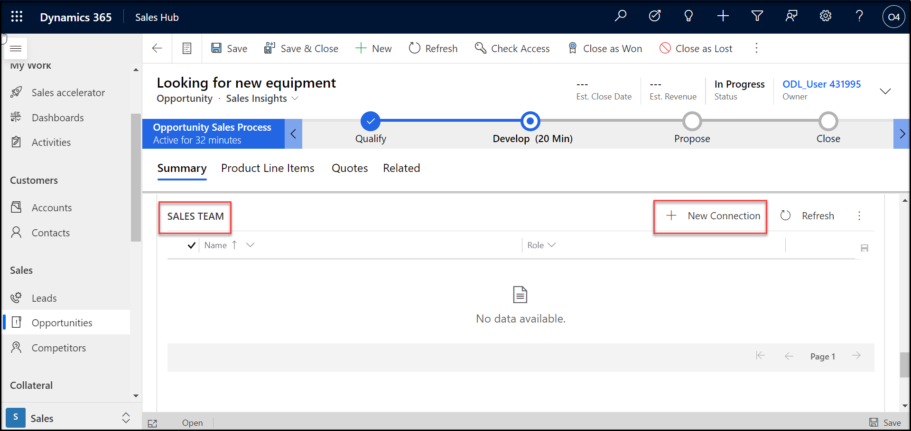

1. Search for and select your user record. Once completed, select the **Add** button.

1. On the Competitors sub-grid, select **Add Existing Competitor**. 

   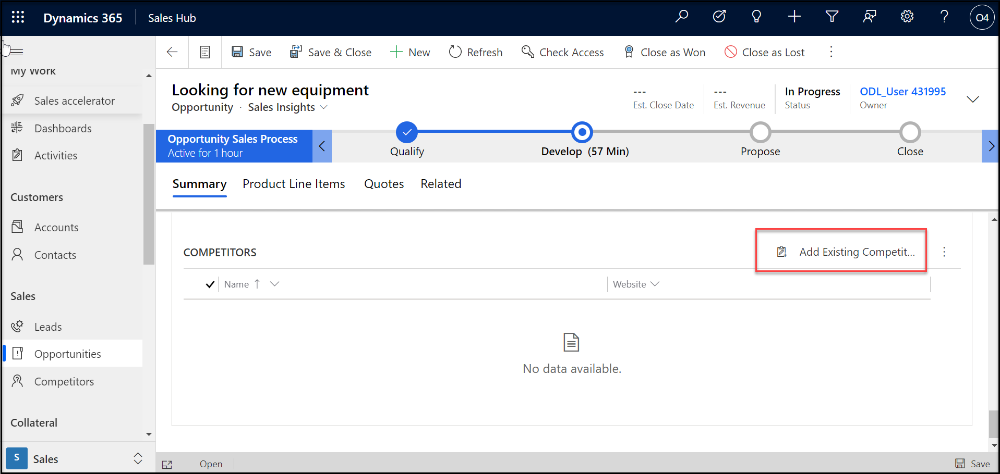

1. On the **Lookup Record** screen, select **New Record**, and then select **Competitors**.

   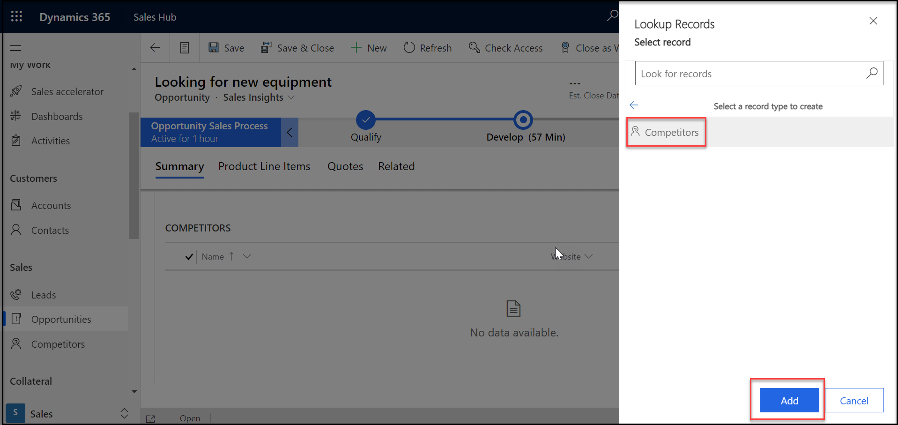

1. In the **Quick Create Competitor** screen, set the **Name** field to **Coho Technologies**.

   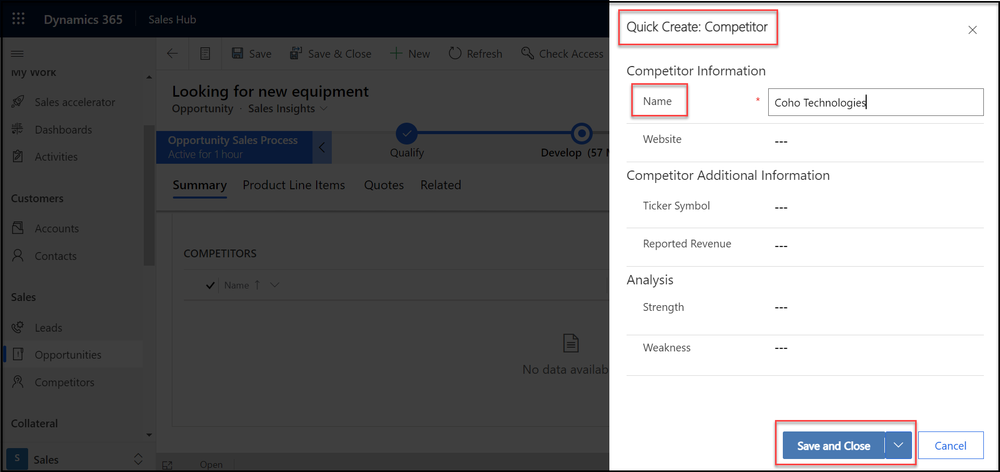

1. Select the **Save and Close** button.

1. **Coho Technologies** should be selected in the lookup record window. Select the **Add** button to finishing adding the competitor. 

   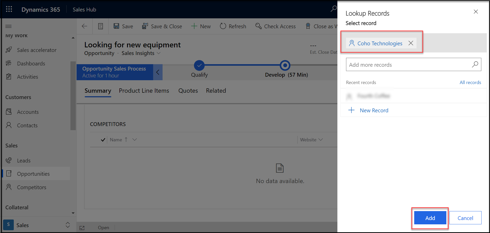

1. Select to select the **Develop** stage on the **Lead to Opportunity** business process flow set both the **Identify Stakeholders** and **Identify Competitors** steps to **Completed**. 

   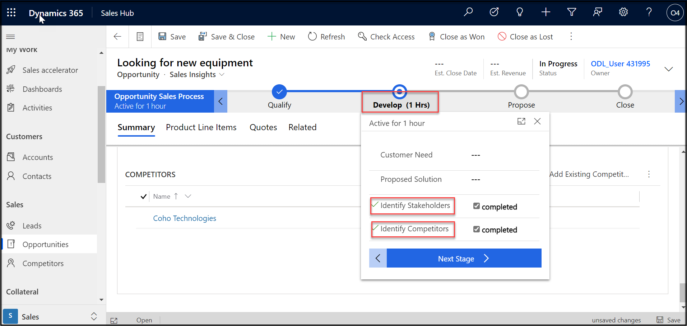

1. Select the **Next Stage** button to advance to the **Propose** stage.

1. On the **Propose** stage, mark all four steps as **Completed**, and select the **Next Stage** button to advance to the **Close** stage. 

   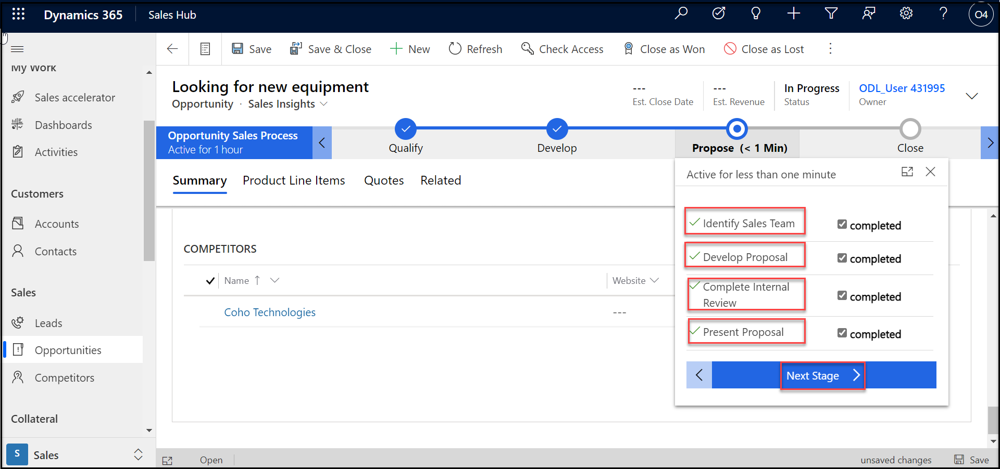

1. On the **Close** stage, mark the **Complete Final Proposal**, **Present Final Proposal**, **Send Thank You**, and **File De-brief** steps as **Completed**. 

1. Set **Confirm Decision Date** to **Todays date**. 

1. Click the **Finish** button. 

   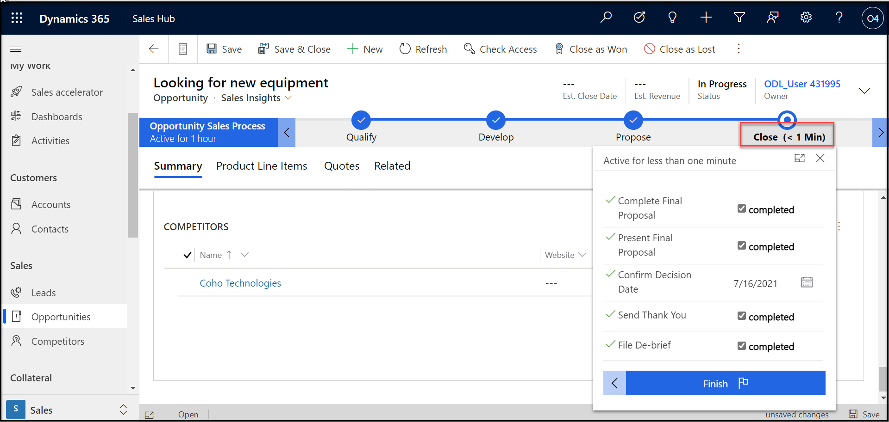

1. Now that you have completed the business process, you need to close the opportunity. On the **Command Bar** of the opportunity, select the **Close as Won** button. 

   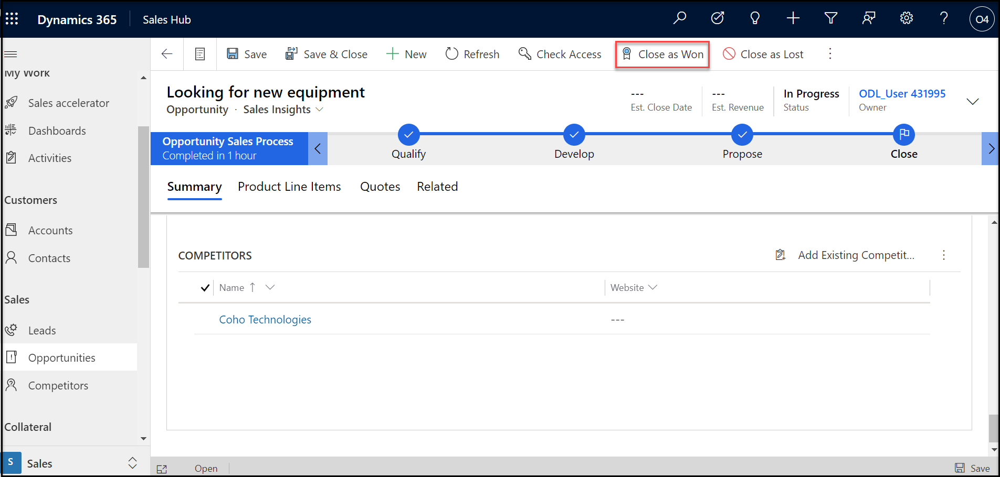

1. On the **Close Opportunity** screen, select the **OK** button to finish closing the opportunity record. 

   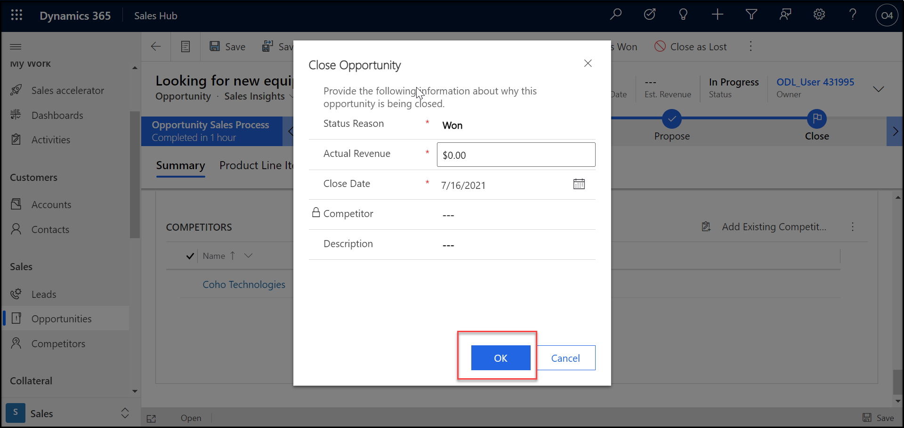
