## Module 2: Learn the Fundamentals of Dynamics 365 Sales

## Practice Lab 2.3 - Dynamics 365 Sales capstone lab

## Lab Scenario

ABC company specializes in the manufacturing, selling, installation and servicing of security equipment. Their products include both indoor and outdoor security cameras, moisture and fire sensors, monitoring services, and more. 

ABC company uses Dynamics 365 applications to engage with all their customers across different areas of their organization from sales to service. 

**Sales and Marketing**

ABC Company markets to their residential customers directly through targeted marketing campaigns. Customers are targeted based on their city, and other factors. Marketing materials are sent through email and based on their interaction with the email are guided accordingly. 

While some of their smaller products are sold through retailers, most products are sold direct to consumers by their internal sale staff.

Internally, they focus on two key areas: 

- **Residential Customers:** Residential customers are typically looking for either individual components, or to buy a whole home solution. These sales cycles are typically shorter and originate from social media, websites, referrals, or direct contact from the prospect. Since residential customers are typically more focused on specific products or smaller installs, their sales cycles typically last a few days or weeks. 

- **Enterprise Customers:** Enterprise sellers focus on customers who need a more specialized and tailored business solutions. Enterprise sales typically span multiple locations with linked communication, and often require multiple resources to complete the project. These sales cycles are typically longer and have many more moving parts. 

It is important that all of ABC company’s sellers have the tools, resources, and guidance necessary regardless of their focus area while selling to their customers. 

**System Installation:**

The installation process for purchased security equipment varies based on the type of customer that was sold. 

- **Residential Customers:** Since residential installs typically take less than a day, they are done by internal employees. After the sale is made, a work order is created, and a qualified technician is identified and scheduled to perform the install. 

- **Enterprise Customers:** Enterprise deploys can take months, and require a project manager to oversee the day-to-day operations. This includes creating project plans, defining project teams, and scheduling resources. 

**Service and Support:**

Once the systems are installed, ABC Company provides support after the sale. If a customer has an issue, they can contact customer support. An agent will attempt to work with the customer remotely to resolve their issue. If their issue cannot be resolved remotely, the support agent can escalate the issue to a work order that will be scheduled and worked on by a qualified field technician.  

## Objectives

You are working as a sales representative on ABC company’s residential sales side. While many of your leads come from company sponsored events, marketing campaigns, and purchased lists you still often receive inquiries from customers directly. When you receive those inquiries, you need to manually enter and work those the lead through the sales lifecycle. 

You recently took a call from someone named Piper Smith. There has been a series of thefts in her neighborhood, and she would like to purchase some home security equipment. You are going to enter the lead from piper into the system, attempt to qualify her, and advance her through the sales cycle. 

Upon completion of the lab, you will have completed the following:

- Enter a lead into Dynamics 365 Sales

- Qualify and convert a lead into a sales opportunity.

- Manage daily activities associated with an opportunity. 

- Add a quote to an opportunity. 

- Close a Sales Opportunity. 

- Generate an invoice. 

## Lab Setup

  - **Estimated Time**: 30 minutes

## Instructions
  
## Exercise 1: Create and Qualify a Lead in Dynamics 365 Sales

### Task 1: Create a new Lead

1. From the list of applications that appears, select **Sales Hub.**

   

1. Using the navigation on the left side of the screen, select **Leads**.

1. To view all the current sales leads in the system, select the down arrow next to **My Open leads**, from the menu that appears select **Active Leads**. 

1. To navigate back to your list of leads, select the down arrow next to Active Leads, and from the menu that appears, select **My Open Leads**. 

1. Next, we will create a new lead for Piper Smith, from the **My Open Leads** view, Select the **New** button on the Command bar.

   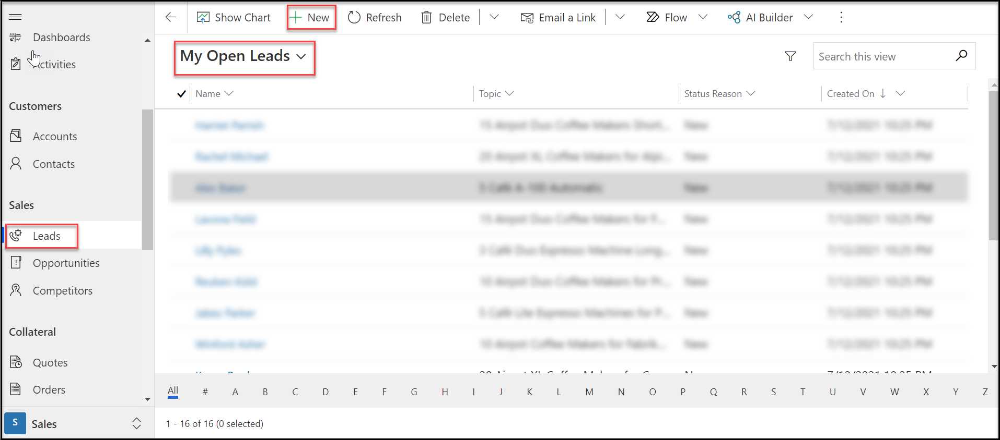

1. Complete your new lead record as follows:

	- **Topic:** Looking for Security Equipment – “Your Name”

	- **First Name:** Piper

	- **Last Name:** Smith - Your Initials

	- **Mobile Phone:** 888 555-1762

	- **Email:** piper@sample.com
	
    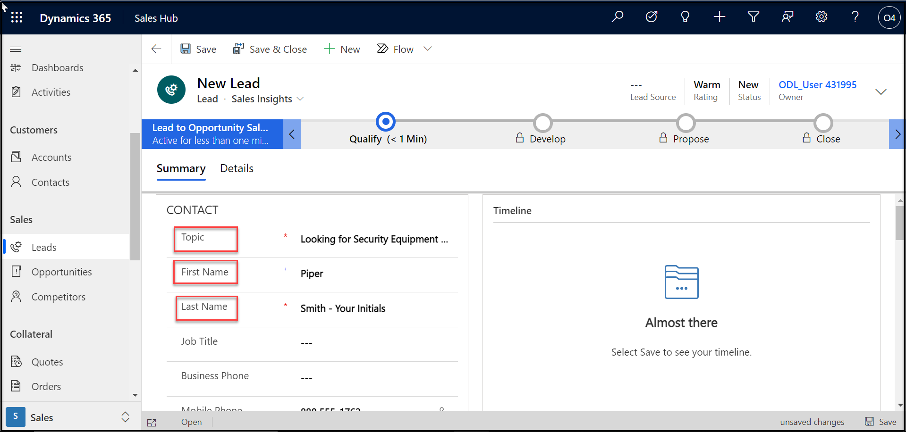	

1. Select the **Save** button on the Command Bar to save the new the Lead and leave it open.

    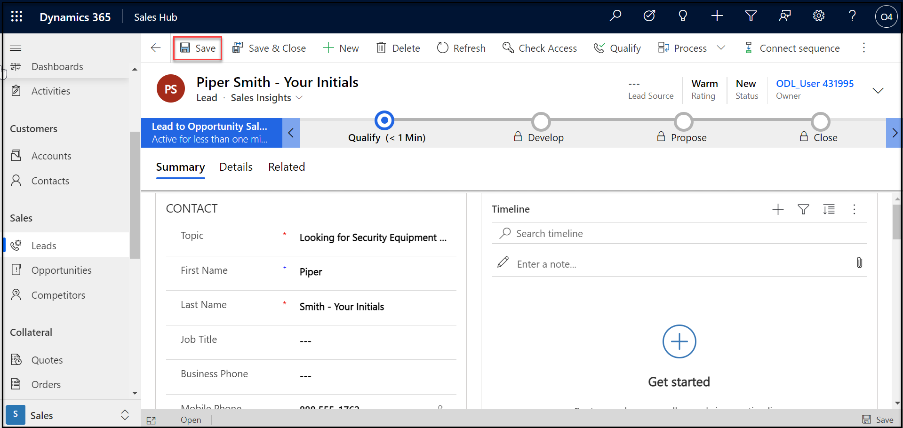

1. Notice the **Lead to Opportunity** Business Process Flow at the top of the record. Select the **Qualify Stage** to select it. Complete the stage as follows:

	- **Purchase Timeframe:** This Quarter

	- **Estimated Budget:** 10000 

	- **Purchase Process:** Individual

	- **Identify Decision Maker:** Completed

1. Select the **X** on the stage window to close the window. 

    

1. Go to the record **Timeline** in the middle of the screen and select the **Plus Sign Icon** to add a new activity. 

1. From the menu that appears, select **Phone Call**.

     

1. On Quick Create Phone Call Screen, complete the phone call as follows:

	- **Subject:** Looking for home security equipment

	- **Phone Number:** 888 555-1762

	- **Direction:** Incoming

	- **Description:** After some instances in her neighborhood, she is looking to purchase a security system. 

1. Select the **Save and Close** button.

   

1. Notice the **Looking for home security equipment** activity is now displayed on the record **Timeline**. 

   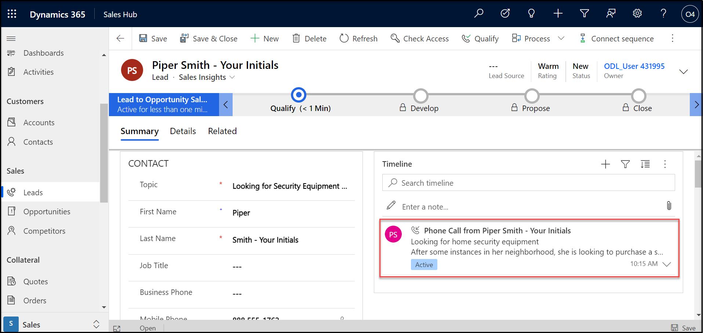

1. Over the activity and select the close activity **Check Mark Icon** to mark the phone call as completed. 

   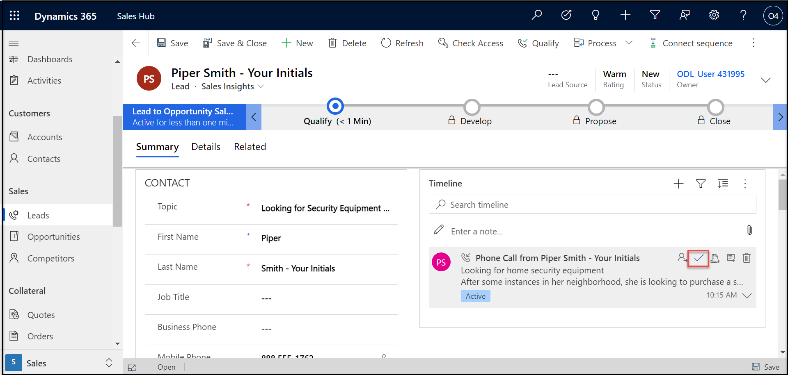

1. On the **Close Phone Call** window, verify the state is set to **Completed**, and select the **Close** button.

   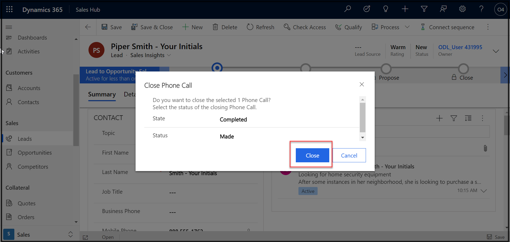

**IMPORTANT:** Do not close the lead record. Leave it open as we will use it in the next task. 

 

### Task 2: Qualify the Lead as an Opportunity

After visiting with Piper, you identify that there is enough interest on her end to justify moving forward, and that we have products and services that would benefit her. Next you will qualify the lead record. This will create a related Opportunity record and move to the next stage of the Lead to Opportunity sales process. 

1. On the **Command Bar**, select the **Qualify** button. 

    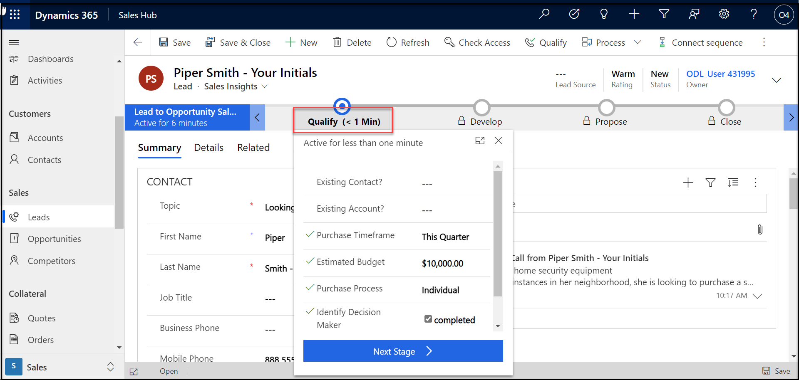

1. After the system qualifies the lead, a new Opportunity record will be created, and the business process will advance to the **Develop** stage. Select the **Qualify** stage to view the original lead record.
 
    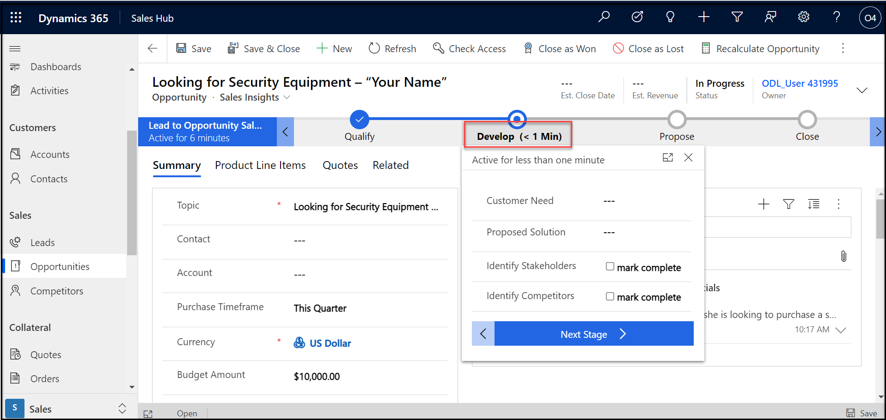

1. Select the **Qualify** stage to return to the lead.

   

1. Select the **Save & Close** button to close the Lead record that was created. 

   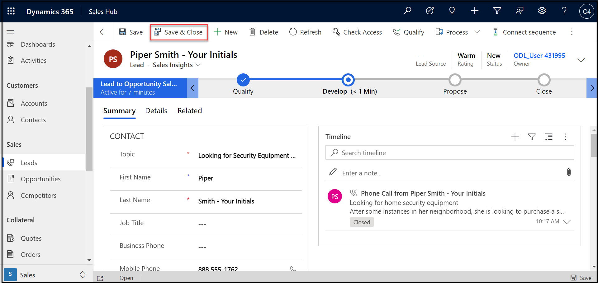

## Exercise 2: Manage a sales opportunity in Dynamics 365 Sales

Now that we have successfully qualified the lead as an opportunity, it is time to work the opportunity through its lifecycle.

### Task 1: Manage a Sales Opportunity & Create a Quote 

1. Using the navigation on the left side of the screen, select **Opportunities**. 

1. Select the drop-down arrow next to the **My Open Opportunities** view, from the menu that appears, select **All Opportunities**.

   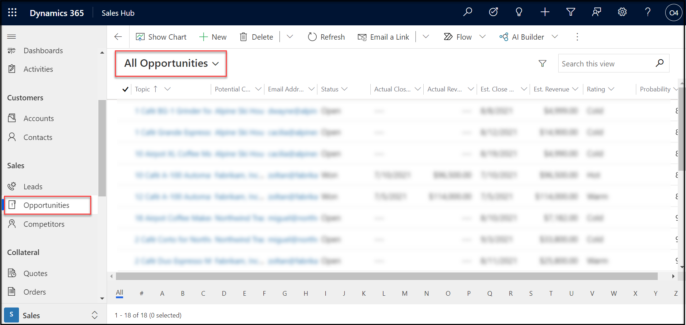

1. On the Command Bar, select Show Chart. Notice that the **Top Customers** chart displays based on the Opportunity table. 

   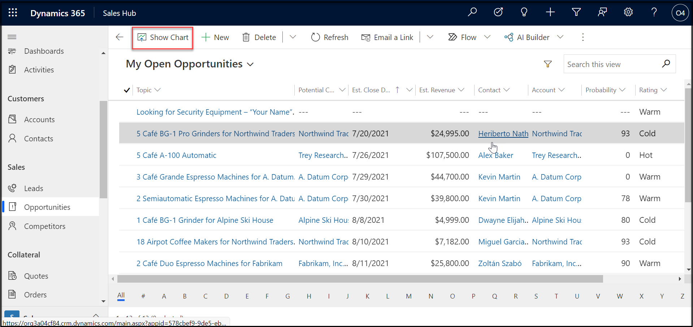

1. Select the drop-down arrow next to **Top Customers**, from the menu that appears, select **Sales Pipeline**.

   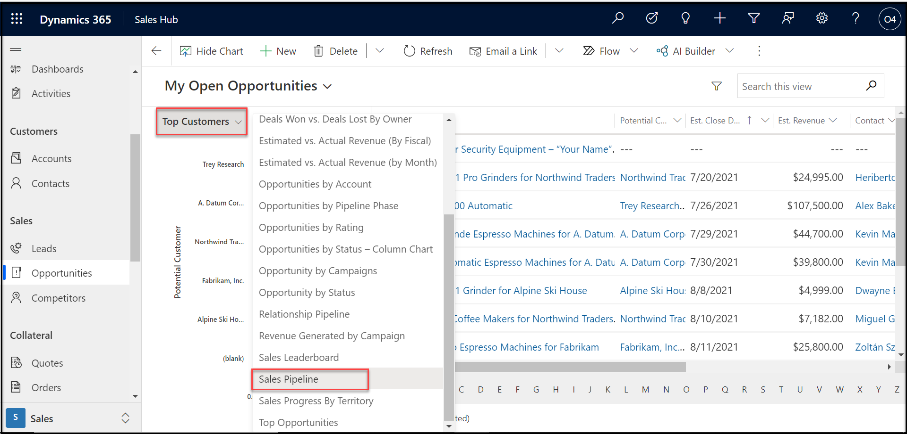

1. Select the Qualify portion of the Funnel. Notice that the list of Opportunities changes to display on the opportunities that in the qualify stage. 

1. Select anywhere in the white space of the chart to display all open opportunities again. 

   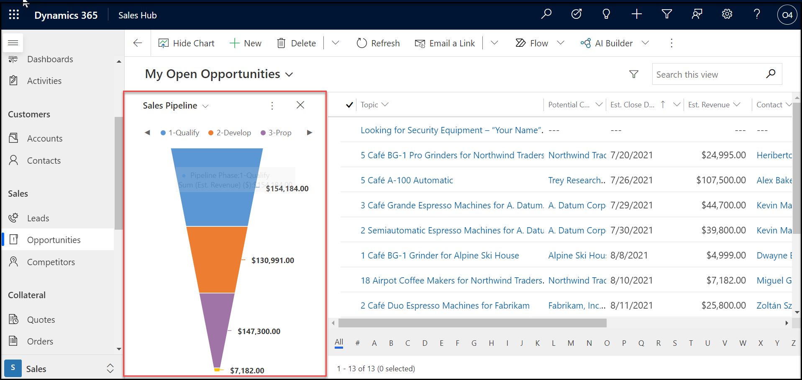

1. Select the drop-down arrow next to the **Open Opportunities** view, from the menu that appears, select **My Open Opportunities**. The **Looking for Security Equipment – Your Initials** will likely be the only item that appears, and the chart should reflect this. 

   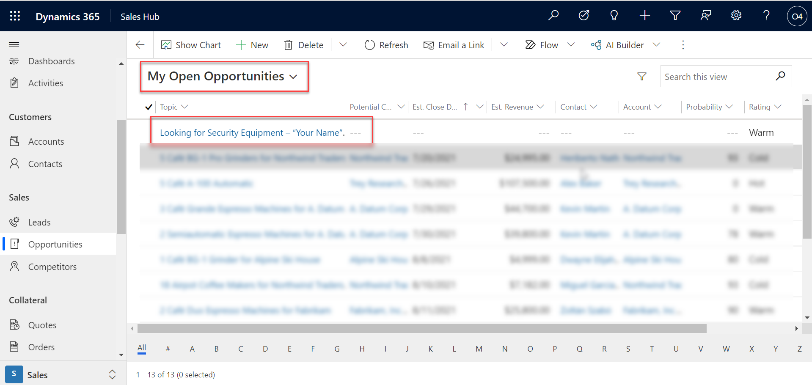

1. On the **Command Bar**, select the **Hide Chart** button. 

   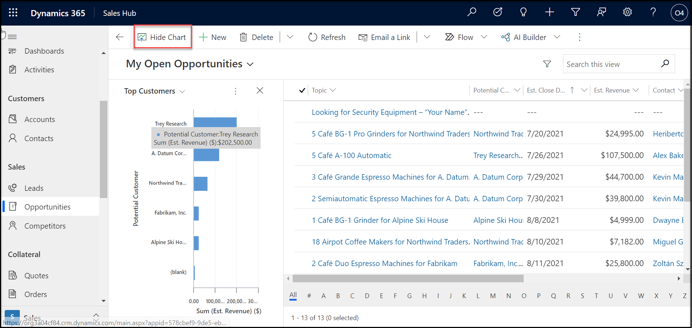

1. Open the **Looking for Security Equipment – Your Initials** that was created when you qualified the lead earlier. Notice the record is already in the **Develop** phase since it was created from a previously qualified Lead.  

   

1. On the **Looking for Security Equipment – Your Initials** opportunity header at the top of the record, select the down arrow next to the owner field. 

1. Complete as follows:

	- **Est. Close Date:** Tomorrow

	- **Est Revenue:** 12,500.00
	
   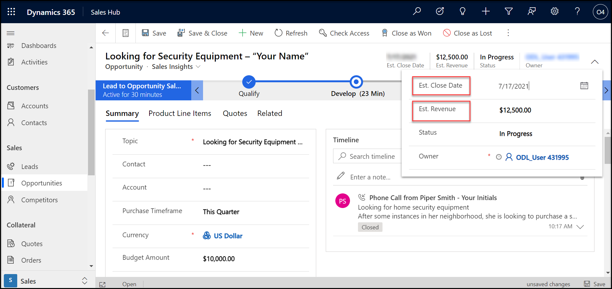

1. Go to the **Record Timeline** in the middle of the screen and select the **Plus Sign Icon** to add a new activity. 

   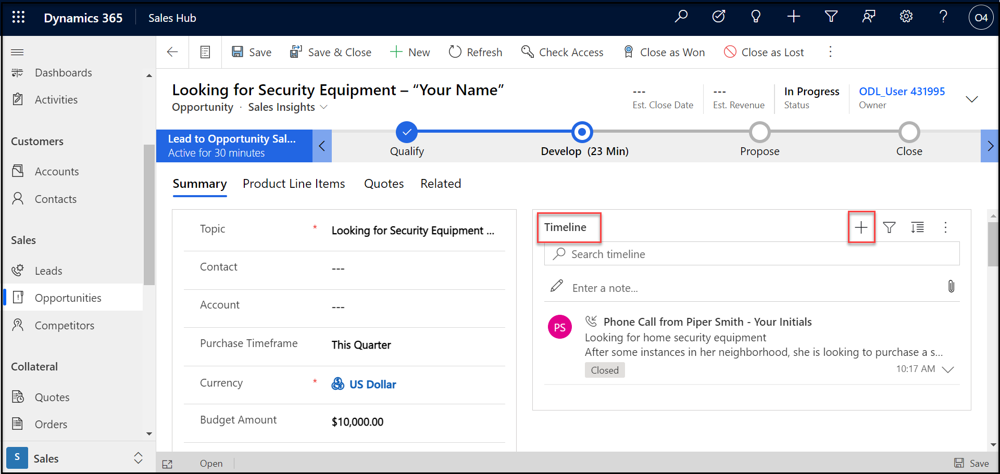

1. From the menu that appears, select **Meeting**.

   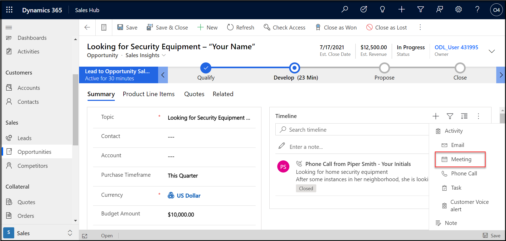

1. On the **Quick Create: Meeting** screen, complete as follows:

	- **Subject:** Quick Meeting – “Your Initials”

	- **Location:** Online

	- **Start Time**: Tomorrow @ 10:00 AM

	- **End Time:** Tomorrow @ 10:30 AM

   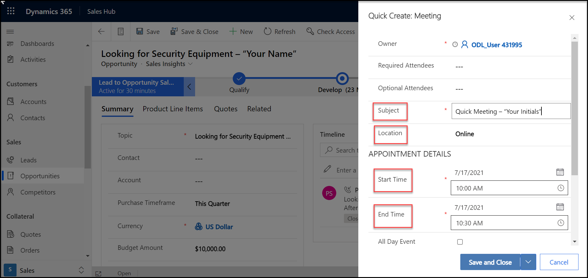

1. On the Command bar, select **Save & Close**

1. On the Lead to Opportunity business process flow, select the **Develop** Stage. Notice that you need to Identify Stakeholders and Competitors.

   

1. Select the **X** on the stage window to close it so you can continue working. 

1. On **Summary** Section below the Lead to Opportunity Business Process Flow, In the contact field click on **+ New Contact**.

   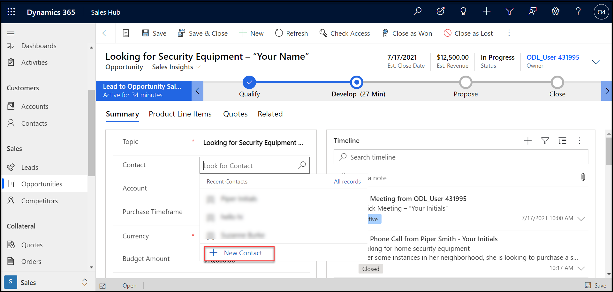

1. Complete as follows:
               
   - **First Name:** Piper 
   - **Last Name:** initals
   
   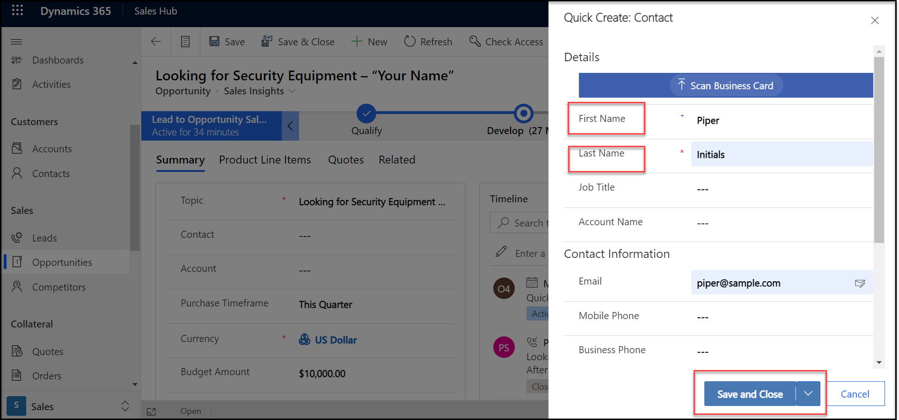   

1. select the **Save and Close** button.

1. Notice the Suzanne Burke is added in the contact field.

    
   
1. In the **Stakeholders** sub-grid, notice **Piper** is already defined as a stakeholder. 

   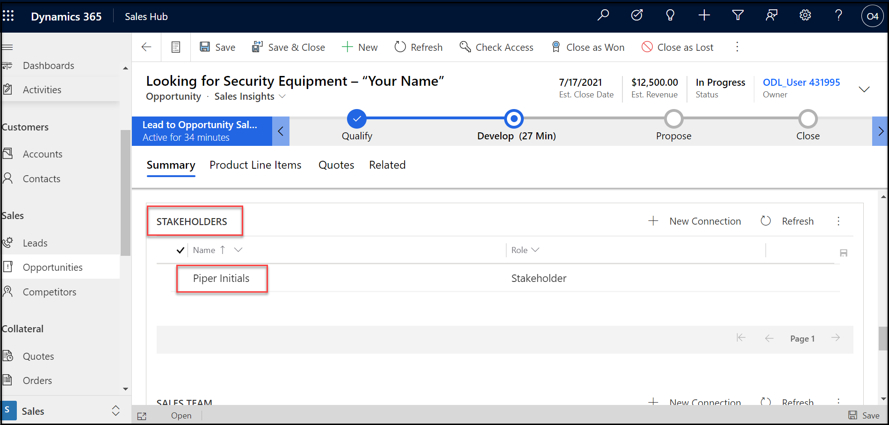 

1. On the Sales Team sub-grid, select the **Vertical Ellipsis**. From the menu that appears select **New Connection**.

   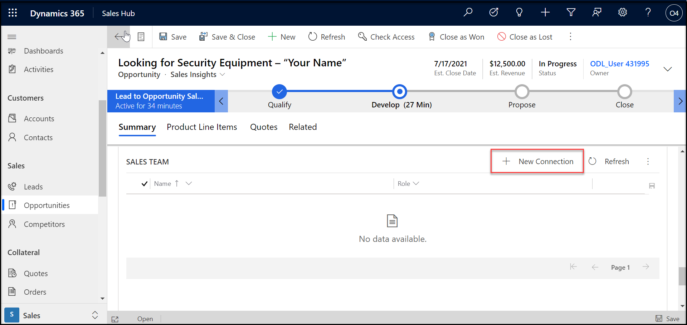 

1. In the **Search** field, enter the text **System** and select the **System Administrator** record. Once completed, select the **Add** button. System Administrator should now appear on the sale team. If not, select the **Refresh** button on the command bar. 

1. On the Competitors sub-grid, select the **Vertical Ellipsis**. From the menu that appears select **Add Existing Competitor**. 

   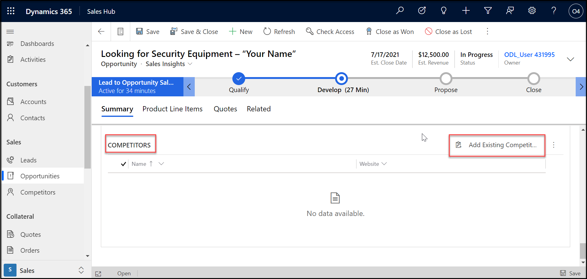 

1. On the **Lookup Record** screen, select **New Record**, and then select **Competitors**.

   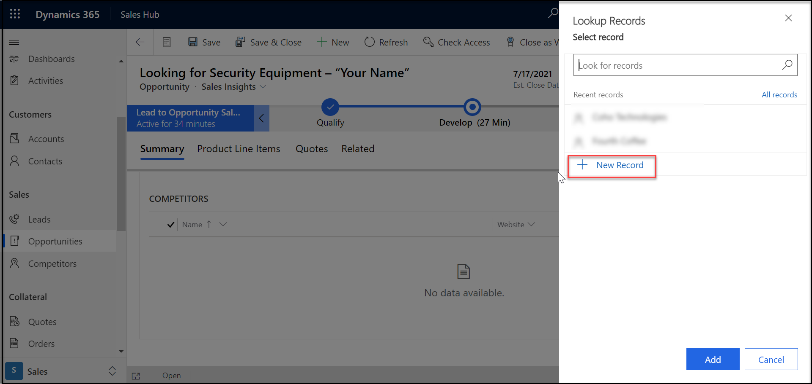 
   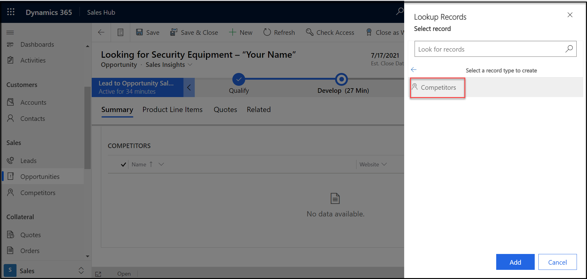 

1. In the Quick Create: **Competitor** screen, set the **Name** field to **Coho Security – “Your Initials”**.

   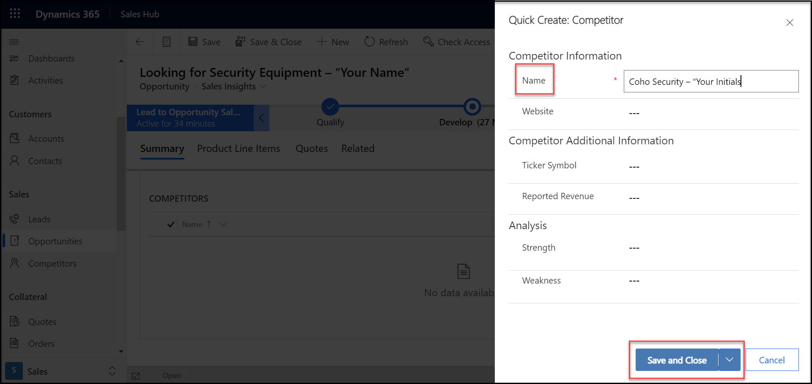 

1. Select the **Save and Close** button.

1. Ensure that the Coho Security record you just created is selected, select the **Add** button.

   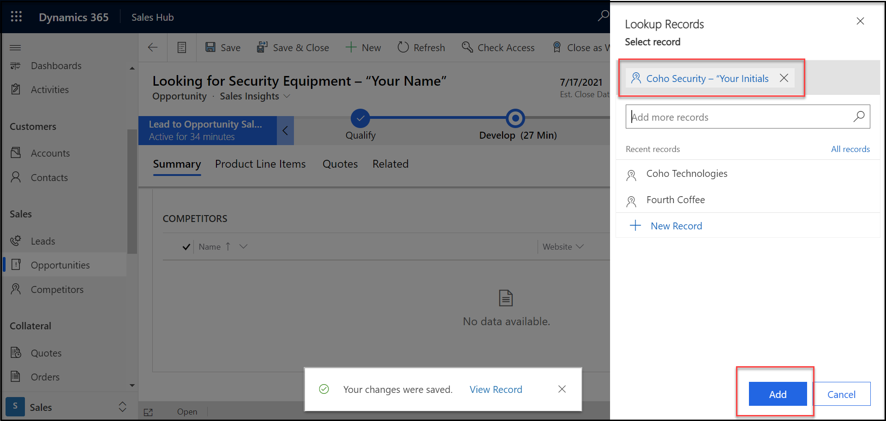 

1. Select the **Develop** stage on the **Lead to Opportunity** business process flow set both the **Identify Stakeholders** and **Identify Competitors** steps to **Completed**. 

   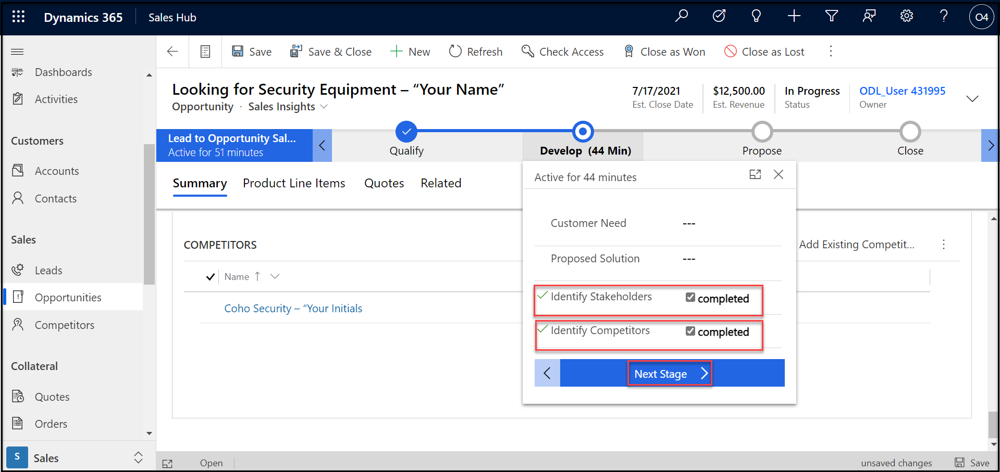 

1. Select the **Next Stage** button to advance to the **Propose** stage.

1. On the **Propose** stage, mark **Identify Sales Team** as **Completed**.

   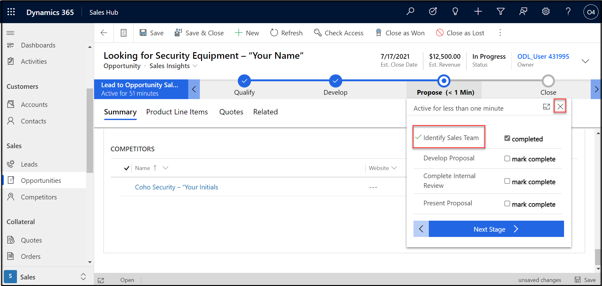 

1. Select the **X** on the Propose stage to close the stage window. 

1. On the opportunity record, select the **Quotes** tab. 

1. On the Quotes sub-grid, select the **New Quote** button.

    

 

**IMPORTANT:** Sine these environments have multiple first party apps deployed it is possible that the quote form that is currently displayed is not the correct one for sales related functionality. If the text under the quote name **Looking for Security Equipment – Your Initials** reads: **Quote . Quote**, the correct form is loaded. If it reads, **Quote . Field Service Information**, you will need to switch it. If you need to change it, Select the drop-down arrow next to **Quote . Field Service Information**. From the menu that appears select **Quote**. 

 

### Task 2: Manage a Quote

Now that you have a related quote, you will prepare the quote to present it to a customer. Under normal circumstances, we would likely add products to the quote record before it is delivered to a customer. Because we are working in shared environments, we are going to skip the adding of quote lines and walk through the delivery of the quote. 

1. You now need to select a Price List to attach to the Opportunity.  Under **Price List** on the left panel.

   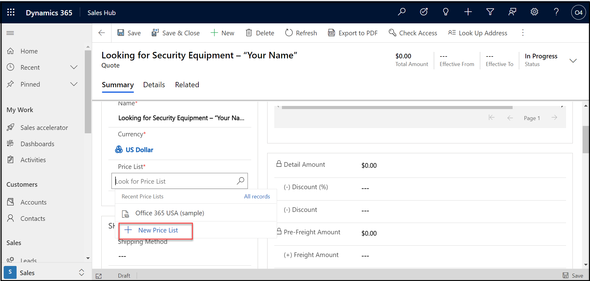

1. click on **+ New Price List** then Enter **Office 365 USA (sample)** and Click on **Save**.
 
   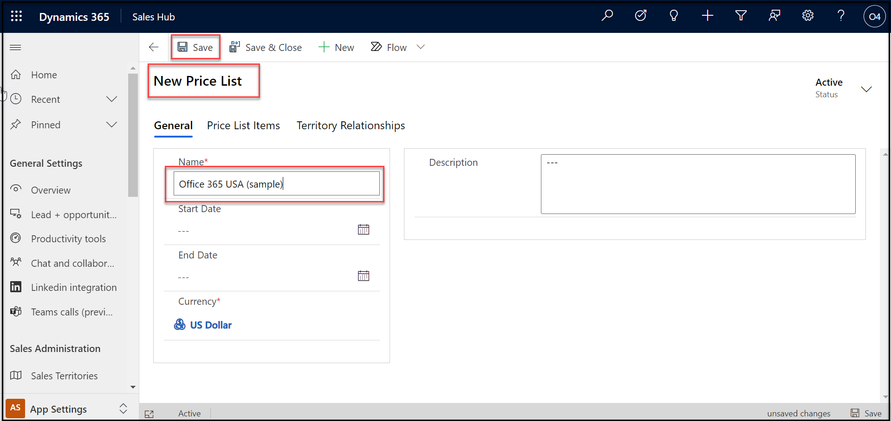

1. On the **Command Bar**, select the **Activate Quote** button to activate the Quote. 

   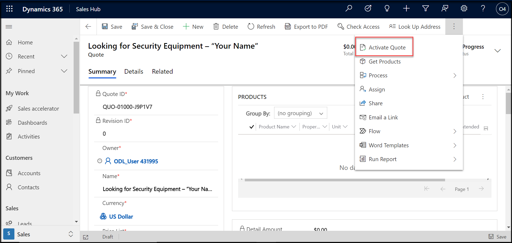

1. Now that the quote has been created, let's update the opportunity record to reflect the new data. On the Quote record, select the **Looking for Security Equipment** – **“Your name”** opportunity in the **Opportunity** field under the **Sales Information** section. The opportunity record should open on your screen.

1. On the Opportunity record, select the **Propose** Stage. 

1. Mark **Develop Proposal**, **Complete Internal Review**, and **Present Proposal** as **Completed**, and Select the **Next Stage** button to advance to the **Close** stage.

   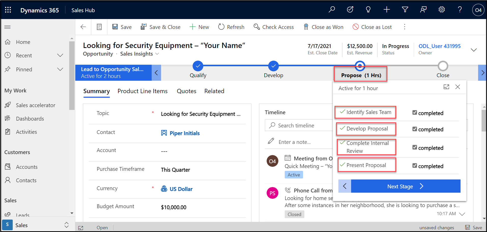

1. On the **Close** stage, mark the **Complete Final Proposal**, **Present Final Proposal**, **Send Thank You**, and **File De-brief** steps as **Completed**. 

1. Set **Confirm Decision Date** to **Todays date**. 

1. Select the **Finish** button. 

   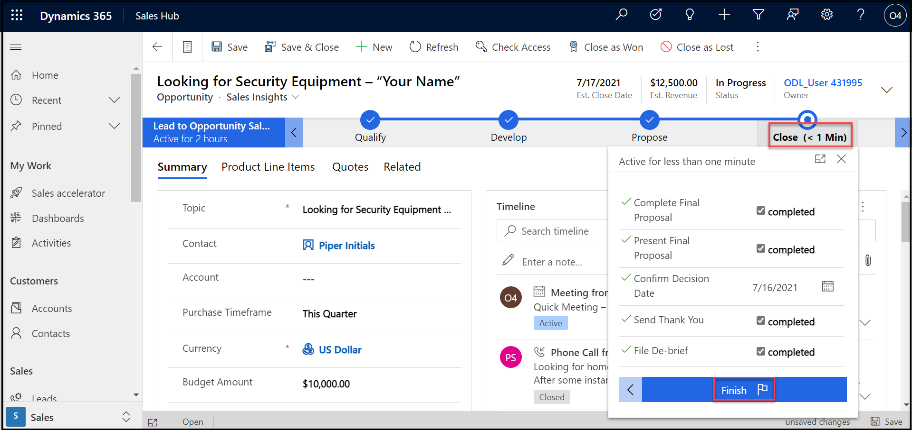

1. Select the **X** on the Close stage window to close the window. 

1. Select the **Quotes** Tab. 

1. Open the **Looking for Security Equipment – Your Initials** Quote. 

1. On the **Command Bar**, select the **Create Order** button.

   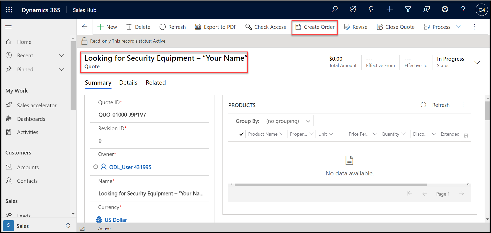

1. On the Create Order Window, complete it as follows:

	- **Status Reason:** Won

	- **Date Won:** Today's Date

	- **Close Opportunity:** Yes

	- **Calculate actual Revenue from quotes:** No

	- **Actual Revenue:** $12,500

1. Select the **OK** button 

   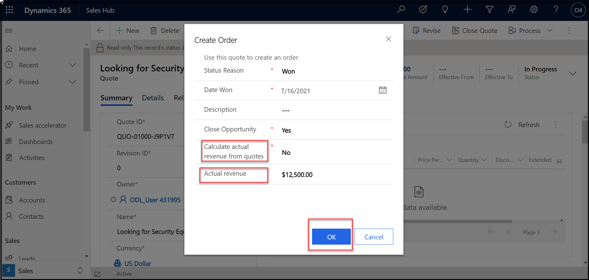

The system creates a new sales order related to the item. In addition, it will close both the quote record, and the related opportunity record. Once everything has been completed the Order will be opened on your screen. Leave the order open. 

###  

### Task 3: Manage the Order and Invoice

Now that you have create a sales order, we will close the order and generate an invoice. Under normal circumstances, products from the quote record would be added to the sales order. Since we are working in shared environments, we are going to move forward as if there were products attached. 

 

1. On the **Command Bar**, select the **Fulfill Order** button. 

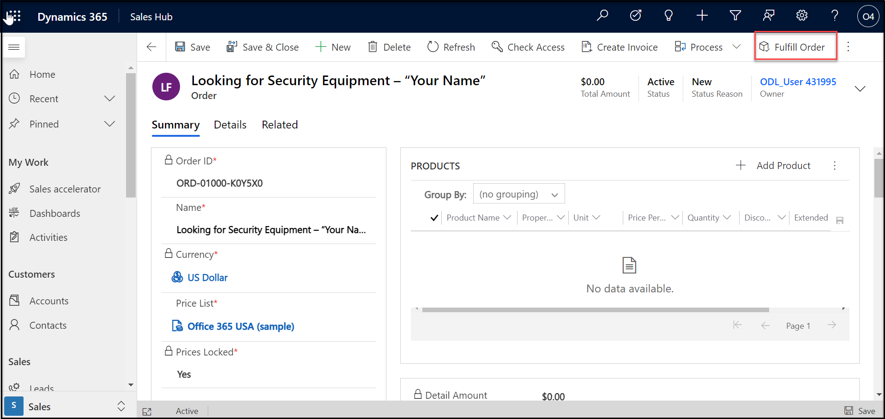

1. On the Fulfill Order screen, complete is at follows:

	- **Status Reason:** Complete

	- **Date Fulfilled:** Todays Date

1. Select the **Fulfill** button. 

   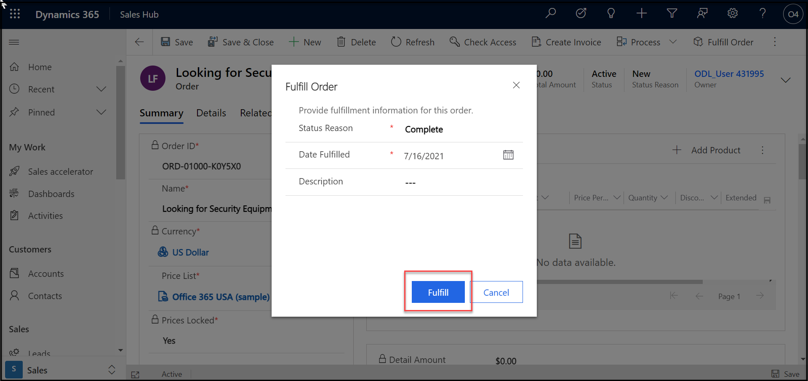

1. On the **Command Bar** of the order, select the **Create Invoice** button. 

   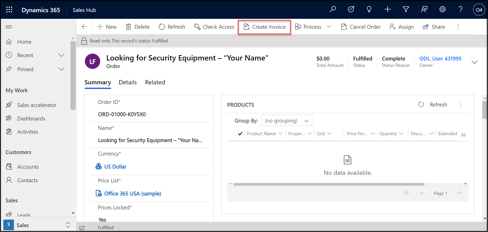

1. On the **Command Bar**, select the **Invoice Paid** button. 

   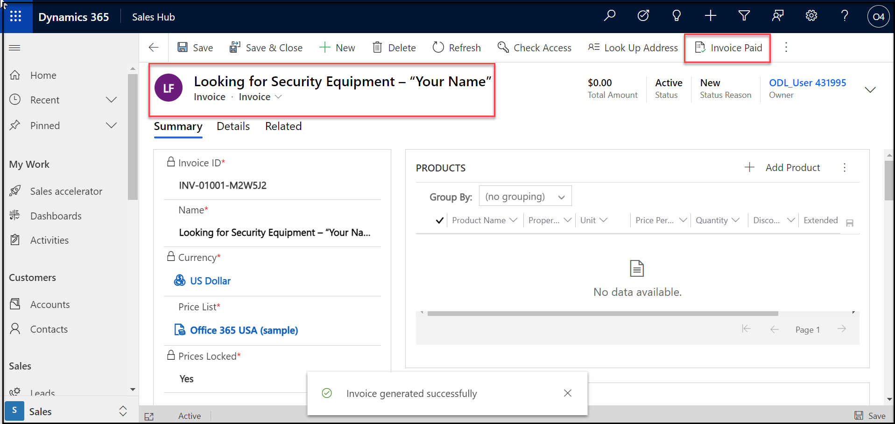
   
1. Select **Ok**.

   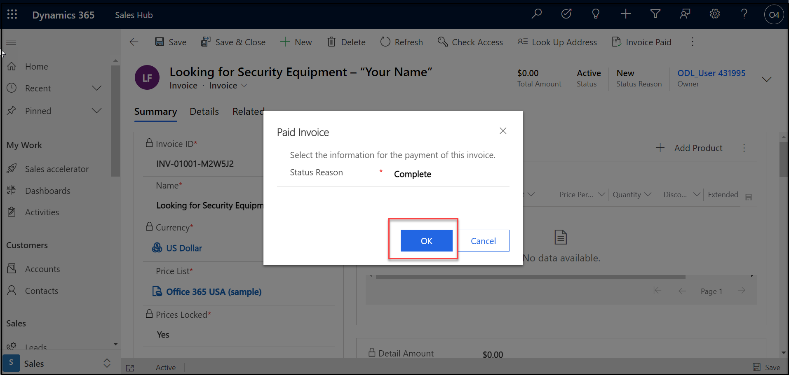
