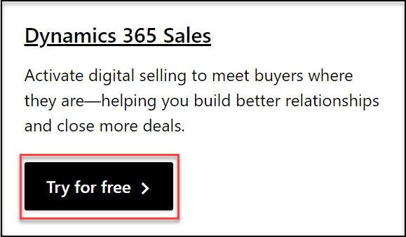
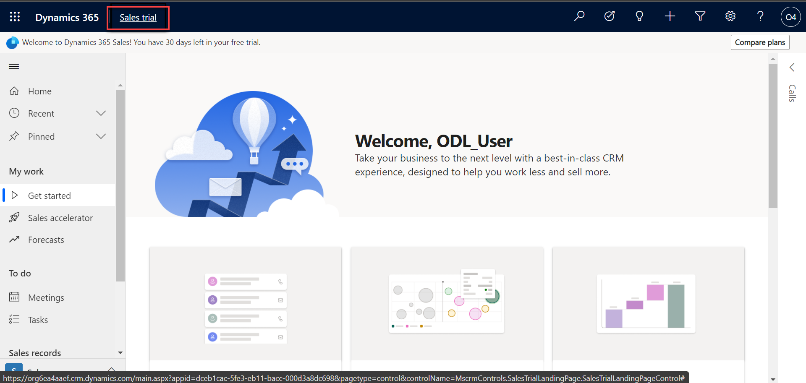
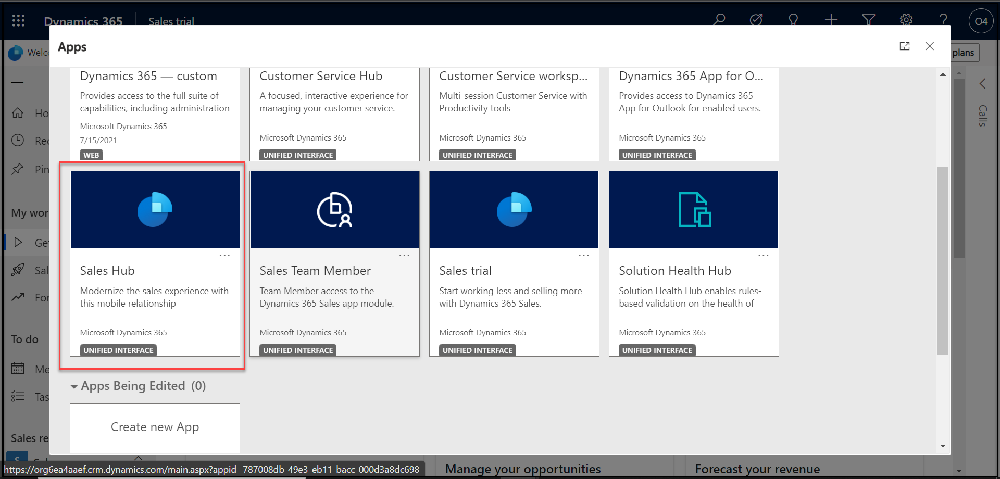

## Getting Started

1. When prompted, use the azure credentials provided in the Environment Details tab.

   

## Instructions
### Sign up for Dynamics 365 Sales Free trial

1. Open the **[Dynamics 365 Sales Trial](https://dynamics.microsoft.com/en-us/dynamics-365-free-trial/)** link. 

    >Note: If Required, You will find Dynamics 365 Sale below, and click on **Try for Free** then Enter the **work email address** as provided in the Environment Details to start your **free trial** and Click on **Start Your free trial**, Then Select your **country** and Enter the **Phone Number**,  Click on **Next**. Else **Skip**.

   
 
1. Click on **Sales trial** on the top Left.

   
 
1. In Dynamics 365 Apps, you will find **Dynamics 365 Sales Hub**. Click on **Dynamics 365 Sales Hub**.

   

1. On the Next Page, Learn about the Fundamentals of Dynamics 365 Sales.
